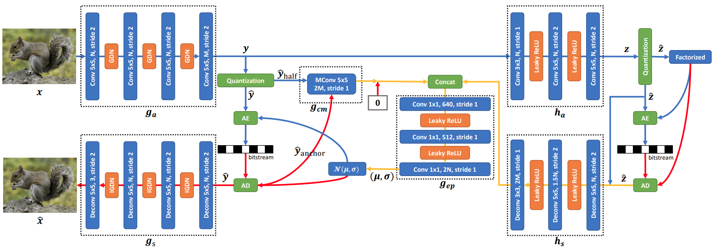
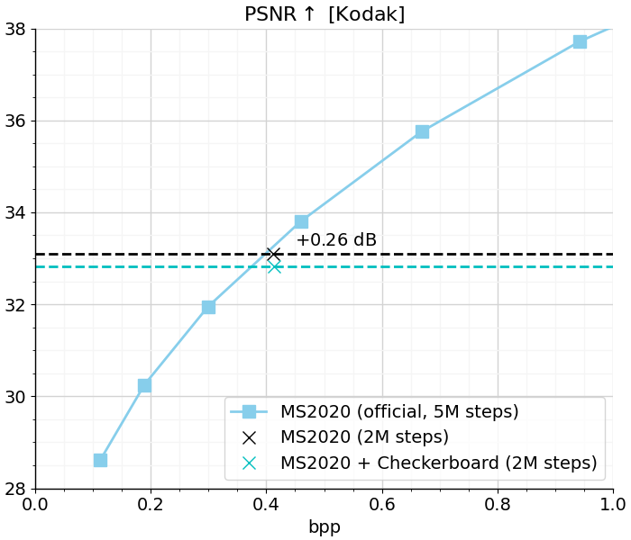

# Checkerboard-Context-Model (TensorFlow 2)

TensorFlow implementation of Checkerboard-Context-Model based on:

- [Checkerboard Context Model for Efficient Learned Image Compression (CVPR 2021)](https://arxiv.org/pdf/2103.15306.pdf),
- [Channel-wise Autoregressive Entropy Models For Learned Image Compression (ICIP 2020)](https://arxiv.org/pdf/2007.08739.pdf).

    

<em>Image source: https://arxiv.org/pdf/2103.15306.pdf</em>

This repository builds on [ms2020.py](https://github.com/tensorflow/compression/blob/master/models/ms2020.py) and not on ["Joint autoregressive and hierarchical priors for learned image
compression" (NIPS 2018)](https://arxiv.org/pdf/1809.02736.pdf) as discussed in the paper due to missing baseline implementations. As such, we replace the ChARM entropy model with the
Checkerboard Context Model and keep everything else fixed (including the LRP) to provide a relative comparison to Minnen et al. 2020
in terms of both compression performance and decoding latency.

We implement the two-step encoding procedure as described in [ELIC, section 6.1](https://arxiv.org/pdf/2203.10886.pdf)

## Acknowledgment

This project is based on [TensorFlow Compression (TFC)](https://github.com/tensorflow/compression), a TF library dedicated to data compression.

This project was inspired by [@JiangWeibeta's PyTorch reference implementation](https://github.com/JiangWeibeta/Checkerboard-Context-Model-for-Efficient-Learned-Image-Compression),
but differs in its technical design/organization.

This project is joint work with [Yang Zhang (@Yango4you)](https://github.com/Yango4you), who conducted his Forschungspraxis at TUM with me.

## MS2020 (ChARM) vs. MS2020 (Checkerboard)

We trained both models from scratch for 2M steps (lr=1e-4 for the first 1.8M steps, lr=1e-5 for the last 200k) on the CLIC 2020 training set. We achieve a decoding speedup of **1.88x**, while only sacrificing 0.26dB in performance.
The relative speedup was calculated on an A100 GPU using GPU warm-up based on the recommendations presented in [ELIC, Supplementary Material, section 2](https://arxiv.org/pdf/2203.10886.pdf).

**Note that this is achieved despite using a significantly smaller model size** (26.4M vs. 116.3M).

    

## Pre-trained models

We release a pre-trained model as proof of functional correctness: [download](https://drive.google.com/file/d/1uUrGN2wNXf98vPBFC-gnXTS7MgTeUDJ8/view?usp=sharing).

## File Structure

     res
         ├── doc/                                       # addtional resources
         ├── eval/                                      # sample images + reconstructions
         ├── train_hzswq2021/                           # model checkpoints + tf.summaries
         ├── hzswq2021/                                 # saved model
     hzswq2021.py                                       # core of this repo

## License
[Apache License 2.0](LICENSE)
